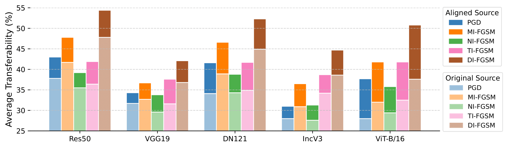

# Improving Adversarial Transferability via Model Alignment

This repository contains the implementation of our ECCV 2024 paper *Improving Adversarial Transferability via Model Alignment* ([paper](https://arxiv.org/pdf/2311.18495)).

**Goal:** Model alignment transforms any source model into one from which attacks generate more transferable perturbations.

**How?** The parameters of the source model are fine-tuned to minimize an alignment loss which measures the divergence in predictions between the source model and another, independently traine model, referred to as the witness model.

---

|  | 
|:--| 
| **Perturbations generated from the aligned source model become more transferable.** We compare the transferability of $\ell_\infty$-norm constrained perturbations (ϵ = 4/255) generated using the source model before and after performing model alignment. This result demonstrates the compatibility of model alignment with various attacks across source models with different architectures. In this figure, the source model is aligned using a witness model from the same architecture but is initialized and trained independently. Results are averaged over all target models. |

## Requirements
To run the code, the following packages are needed:
- python 3.9.15
- pytorch 2.0.1
- torchvision 0.15.2
- numpy 1.22.4
- torchattacks 3.4.0
- timm 1.0.3

## Checkpoints
For reproducibility and to facilitate future research on model alignment, we provide checkpoints for several models, including ResNet18, ResNet50, ViT-T/16, and ViT-B/16. Each model is initialized and trained with different seeds, resulting in a total of 9 unique, unaligned (vanilla) model checkpoints.

We also provide two aligned model checkpoints for specific configurations:

```aligned_res50.pt```: ResNet50 aligned with ResNet18 for 1 epoch using ```--batchsize 128 --lr 0.001```.  
```aligned_vit_b_16.pt```: ViT-B/16 aligned with ViT-T/16 for 1 epoch using ```--batchsize 512 --lr 0.1 --clip_grad_norm 1.0```.

Alignment for both models was performed using 2 GPUs to ensure sufficient computational resources. You can access all the model checkpoints [here](https://drive.google.com/drive/folders/1uQTl4Lncd8gBi0naj9LUdTEdHXj3op5o?usp=sharing).

## Project Structure
- `src/align.py`: Implementation of model alignment.
- `src/utils*`: Utility scripts.
- `options/default.yaml`: Default hyper-parameters.

## Usage:
### Aligning Res50 using Res18 and evaluating transferability on VGG19 as the target model (single GPU):
```
python3 main.py --output_dir <path to output files> --data_dir <path to the imagenet folder> \
--source_arch res50 --source_dir <path to the source model> \
--witness_arch res18 --witness_dir <path to the witness model> \
--target_arch vgg19_bn --target_dir <path to the target model> \
--lr 0.001 --save_modified_model 1 --eval_standard 0 --eval_whitebox 0 --eval_transfer 1
```

### Aligning ViT-B/16 using ViT-T/16 and evaluating transferability on SWIN as the target model (Multiple GPU):
```
python3 main.py --output_dir <path to output files> --data_dir <path to the imagenet folder> \
--source_arch vit_b_16 --source_dir <path to the source model> \
--witness_arch vit_t_16 --witness_dir <path to the witness model> \
--target_arch swin_s --target_dir <path to the target model> \
--lr 0.1 --clip_grad_norm 1.0 --save_modified_model 1 --eval_standard 0 --eval_whitebox 0 --eval_transfer 1 \
--dist-url "tcp://127.0.0.1:33967" --dist-backend 'nccl' --multiprocessing-distributed --world-size 1 --rank 0
```

### Evaluate Only (by specifying ```--eval_arch```, ```--eval_dir```):
```
python3 main.py --output_dir <path to output files> --data_dir <path to the imagenet folder> \
--eval_arch <source model architecture> --eval_dir <path to the source model> \
--target_arch <target model architecture> --target_dir <path to the target model> \
--eval_standard 0 --eval_whitebox 0 --eval_transfer 1 --atk pgd --pgd_eps 4./255. --pgd_alpha 1./255. --pgd_itr 20
```

### Key Arguments
Please see `src/args.py` for a complete breakdown and default values of all input arguments.

- `--output_dir`
  - **Description:** Directory to save model checkpoints and logs.
  - **Example Usage:** `--output_dir ./results`

- `--data_dir`
  - **Description:** Path to the ImageNet folder.
  - **Example Usage:** `--data_dir ./dataset/imagenet`

- `--source_arch`, `--witness_arch`, `--target_arch`, `--eval_arch`
  - **Description:** Specifies the model architectures.
  - **Example Usage:** `--source_arch resnet50`
  - **Note:** Specifying `eval_arch` enters evaluation-only mode and ignores `source_arch` and `witness_arch`

- `--source_dir`, `--witness_dir`, `--target_dir`, `--eval_dir`
  - **Description:** Paths to the model checkpoints.
  - **Example Usage:** `--source_dir ./ckpt/res50.pt`

- `--eval_transfer`, `--eval_standard`, `--eval_whitebox`
  - **Description:** Evaluate transferabilty, standard accuracy, and accuracy under the whitebox attack setting.
  - **Example Usage:** `--eval_transfer 1`, `--eval_whitebox 0`

- `--atk`
  - **Choices:** `pgd`, `mi`, `ni`, `vni`, `vmi`, `sini`, `ti`, `di`
  - **Description:** Specifies the attack algorithm

## License
MIT License
